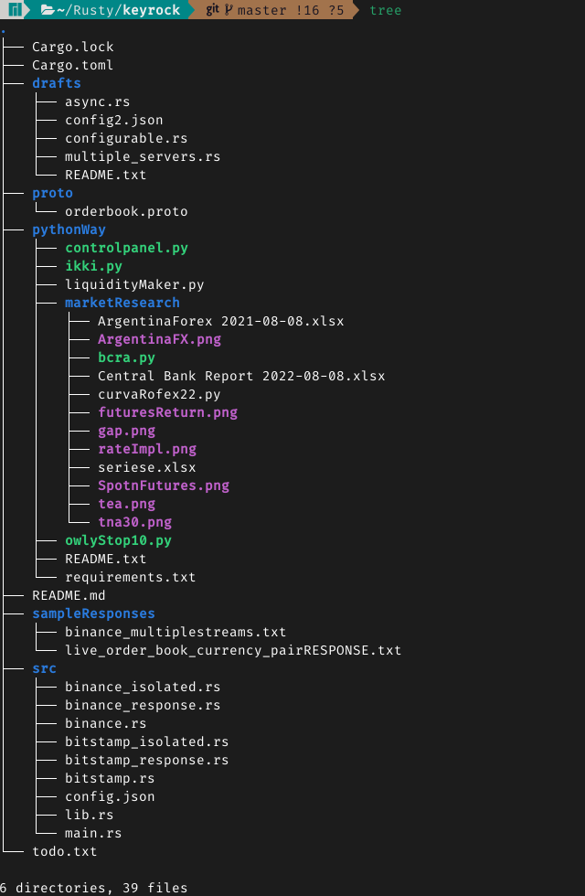

# This project is my approach for the Keyrock-Challenge with Rust
*** Also this documents aims to record my walkthrough in this journey


### Disclaimer: The pythonWay is a python approach that I did in order
### to have an image of what were the steps needed to do the challenge.

Problem to solve:

Provide liquidity to the market at the lowest cost possible, therefore
we nees a system that reads the market and return the fair price of
currencies. 

By steps: we have to connect to multiple exchanges, retrieve simultaneously currency pairs
(i.e. BTC/USDT for binance or BTCUSD for bitstamp).Once stablished connection you need to 
get the bid-ask spread:

Formula: (ask - bid) / ask

This is done in order to obtain the "fair price" at the moment in
which the market are assigning price to the assets.

For strategies of market making, where you need to provide volume
to the market (make more easier for investors to operate or be able
to buy/sell more easily) you need to acknowledge the fair price to
provide liquidity at the minimum expense. 


# COMMANDS. Run websockets by separate

# Main. Run both websockets {Binance&&Bitstamp}
```bash
cargo run --bin main

path = "src/main.rs"
```

# Binance
```bash
cargo run --bin binance

path = "src/binance_isolated.rs"
```


# Bitstamp
```bash
cargo run --bin bitstamp

path = "src/bitstamp_isolated.rs"
```


The goals aimed for the software include:

 (1) Connection to two exchanges simmultaneously (Binance & Bitsmap)
// generate two streams to generate connection & merge them.

 (2) Pull the order book from a configurable currencies
// Set configuration as a variable in order the user can test it with different pairs

 (3) Combine the results.
// Data cleaning
 (4) From the result publish the spread, top ten bid & asks through gRPC server as a stream.


### tree of the project



MENTAL NOTE: I am afraid yet excited to see what results I gain.


TO DO:
- [x] (1) Connection to Websockets 
- [ ] (2) Merge Connections 
- [x] (3) Pulls orderbooks bids & asks 
- [ ] (4) Merge and sort orderbooks 
- [ ] (5) Obtain the spread (ask-bid/ask), top ten bids, top ten asks && publish it as a stream.

DIFFERENCE BETWEEN PYTHON && RUST? in short

Python lets you can go directly where you want and if you have a library that
assist you. You do not have to rewrite the wheel, but also you can't if 
you need to. You are shaped to think only to succeed.
Rust its more challenging. It demands a deeper knowledge of all steps but also
lets you write it as you want (without being unsafe), you have to think "what if my function fails and returns an error", make your program more resilient
as you are prepare not only for the success but also for the failure.

&& Criteria in order to develop

As soon as you achieve a functionality you will have to ask yourself before adding
it to your program the following questions:

What is the goal of the program? What problem you try to solve?

Describe it plain and simple.

what is the vision/approach you are following doing this?

is it readable/simple? 

what value it adds this version compared to the previous one?

how can i debug it? where does it crash?

what updates demands in the rest of the code in order to implement it?

Once you end a program, it will be the sum the whole process and not only
the last version.
